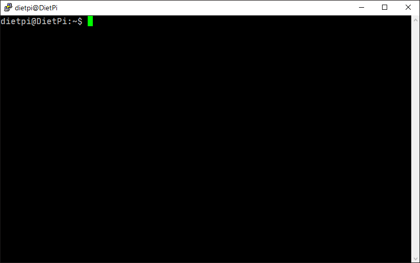

# node-zero

A Node.js installer for armv6 [unofficial builds](https://unofficial-builds.nodejs.org/).


## Installation

Use curl or wget to download node-zero.

```bash
curl https://github.com/wuuzw/node-zero/releases/latest/download/node-zero
```

or

```bash
wget https://github.com/wuuzw/node-zero/releases/latest/download/node-zero
```
## Usage
Run and follow the prompt

```bash
sudo ./node-zero
```

## Support for node CLI tools
Add this line to `~/.profile` file:

```bash
export PATH=/opt/nodejs/bin:$PATH
```

## Contributing
Pull requests are welcome. For major changes, please open an issue first to discuss what you would like to change.

## License
[MIT](LICENSE)
